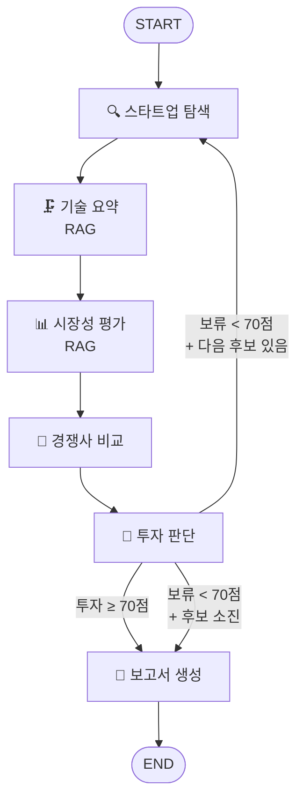

# AI 스타트업 투자 평가 에이전트 — 설계 산출물

---

## 1. 도메인 선정

### 선정 도메인: Climate Tech

### 선정 근거

3개 후보 도메인(Climate Tech, Energy, AgTech)을 아래 5가지 기준으로 비교 분석한 결과, **Climate Tech**을 최종 도메인으로 선정하였다.

| 평가 기준 | Climate Tech | Energy | AgTech |
|---------|-------------|--------|--------|
| 공개 자료 풍부성 | ★★★★★ | ★★★★★ | ★★★☆☆ |
| 문제→해결 구조 명확성 | ★★★★★ | ★★★★☆ | ★★★★☆ |
| 시장 규모 / VC 투자 근거 | ★★★★☆ | ★★★★★ | ★★★★☆ |
| 경쟁사 비교 용이성 | ★★★★☆ | ★★★★☆ | ★★★☆☆ |
| RAG 적합성 | ★★★★★ | ★★★★☆ | ★★★☆☆ |
| **종합** | **1위** | **2위** | **3위** |

#### 핵심 선정 이유

1. **RAG 자료 풍부성이 가장 높음**
   - 기후/탄소 영역은 국제 표준(GHG Protocol, ISO 14064), 규제(EU CBAM), 공시 프레임워크가 체계적으로 공개되어 있음
   - 기업용 탄소회계/데이터 플랫폼에 대한 제품 설명·케이스·벤더 비교 자료가 풍부

2. **문제→해결 구조가 명확함**
   - "기업은 Scope 1/2/3 배출을 정확·감사가능하게 만들기 어렵다 → 탄소회계/데이터 플랫폼이 이를 자동화한다"
   - 투자 판단 시 문제의 심각성과 솔루션의 적합성을 평가하기 용이

3. **시장 성장성**
   - 글로벌 탄소회계 시장: 2025년 약 219.6억 달러 → 2030년 794.6억 달러 (연평균 29.33% 성장)
   - 2024년 Climate Tech VC+PE 자금: 약 560억 달러 (PwC 기준)

4. **경쟁사 생태계가 비교 분석에 적합**
   - Persefoni, Plan A, Watershed, 카본사우루스 등 글로벌+국내 플레이어가 명확히 존재
   - SaaS 기반 비즈니스 모델로 비교 지표(기능, 가격, 커버리지)가 표준화되어 있음

### Climate Tech 도메인 개요

- **정의**: 기후변화 대응을 위한 탄소 감축, 탄소 측정·보고·검증(MRV), ESG 데이터 관리 등의 기술 솔루션
- **핵심 유스케이스**:
  - CBAM 대응용 제품/공정 배출 산정체계 구축
  - Scope 1/2/3 배출 추적·감사로그 관리
  - 내부 감축 과제(에너지/물류/구매) 우선순위화
- **주요 규제 드라이버**: EU CBAM(2026년 확정 시행), K-ETS(한국 배출권거래제), 탄소중립기본법

---

## 2. 에이전트 설계

### 2.1 에이전트 정의

| 에이전트 | 역할 | RAG 여부 | 주요 도구 |
|--------|------|---------|--------|
| 🔍 스타트업 탐색 에이전트 | Climate Tech 도메인의 AI 스타트업 발굴 및 리스트업 | X | Tavily 웹서치 |
| 🗜️ 기술 요약 에이전트 | 스타트업의 핵심 기술력, TRL, IP 분석 | **O** | RAG 문서 검색 |
| 📊 시장성 평가 에이전트 | TAM/SAM, 시장 성장성, 수요 분석 | **O** | RAG 문서 검색 + Tavily 웹서치 |
| 🥊 경쟁사 비교 에이전트 | 경쟁 구도 파악, 차별성 분석 | X | Tavily 웹서치 |
| 🧮 투자 판단 에이전트 | Scorecard + Bessemer 기반 점수 산출 및 투자/보류 결정 | X | 이전 에이전트 결과 활용 |
| 📝 보고서 생성 에이전트 | 전체 분석 결과를 종합한 투자 보고서 작성 | X | 이전 에이전트 결과 활용 |

### 2.2 에이전트별 상세 설명

#### 스타트업 탐색 에이전트
- **입력**: 도메인명 ("Climate Tech")
- **동작**: Tavily API로 "Climate Tech AI startup funding 2024 2025" 등의 쿼리로 웹서치 수행 → LLM이 검색 결과를 파싱하여 스타트업 5개를 구조화된 JSON으로 반환
- **출력**: 스타트업 리스트 (이름, 설명, 홈페이지, 설립연도, 펀딩 단계, 핵심 기술)
- **재진입 시**: 이미 발굴한 리스트에서 다음 스타트업으로 인덱스 이동

#### 기술 요약 에이전트 (RAG 적용)
- **입력**: 현재 평가 대상 스타트업 정보
- **동작**: RAG 벡터DB에서 해당 기술 관련 문서 청크를 검색(예: "탄소회계 Scope 3 산정 방법론") → LLM이 검색된 문서 + 스타트업 정보를 기반으로 기술 분석문 작성
- **출력**: 핵심 기술 설명, 기술 차별화 포인트, IP/특허 현황, 기술 리스크, TRL 등급(1~10)
- **RAG 활용 포인트**: GHG Protocol, ISO 14064 등의 기술 표준 문서에서 해당 스타트업 기술의 표준 적합성 근거 추출

#### 시장성 평가 에이전트 (RAG 적용)
- **입력**: 현재 평가 대상 스타트업 정보 + 도메인
- **동작**: RAG에서 시장 리포트 데이터 검색 + Tavily로 최신 시장 뉴스 보완 → LLM이 시장 분석문 작성
- **출력**: TAM/SAM/SOM 추정치, 시장 성장률(CAGR), 수요 드라이버, 시장 리스크, 시장 타이밍 평가
- **RAG 활용 포인트**: PwC State of Climate Tech 리포트에서 투자 규모, 시장 전망 수치 근거 추출

#### 경쟁사 비교 에이전트
- **입력**: 현재 평가 대상 스타트업 정보 + 도메인
- **동작**: Tavily로 경쟁사 정보 검색 → LLM이 경쟁 매트릭스 작성
- **출력**: 직접 경쟁사 3~5개, 비교 매트릭스(기술/시장점유율/펀딩/팀), 스타트업의 강점/약점, 진입장벽 분석

#### 투자 판단 에이전트
- **입력**: 기술 요약 + 시장성 평가 + 경쟁사 분석 결과
- **동작**: LLM이 Scorecard Method 6항목 점수(0~100) + Bessemer Checklist 10문항(YES/NO) 산출 → 가중 합산하여 종합 점수 계산 → 임계값(70점) 기준 투자/보류 판정
- **출력**: Scorecard 항목별 점수 및 근거, Bessemer 답변 및 근거, 종합 점수, 투자/보류 결정, 판단 사유

#### 보고서 생성 에이전트
- **입력**: 모든 평가 결과 (투자/보류 모두 포함)
- **동작**: LLM이 전체 분석 결과를 종합하여 투자 보고서 형식으로 작성
- **출력**: Markdown 형식의 투자 평가 보고서 (SUMMARY ~ REFERENCE)

### 2.3 RAG 적용 설계

#### 적용 에이전트
- **기술 요약 에이전트**: 기술 표준/규제 문서에서 스타트업 기술의 적합성 근거 검색
- **시장성 평가 에이전트**: 시장 리포트에서 규모/성장률/투자 데이터 검색

#### RAG 문서 구성 (최대 4개, 각 50p 이하)

| # | 문서명 | 용도 | 활용 에이전트 |
|---|------|------|-----------|
| 1 | PwC — State of Climate Tech 2024 | 시장 규모, 투자 트렌드, VC 동향 | 시장성 평가 |
| 2 | GHG Protocol — Scope 3 Standard Executive Summary | 탄소회계 표준, 기술 요구사항 | 기술 요약 |
| 3 | EU CBAM 공식 시행 안내 문서 | 규제 드라이버, 시장 수요 근거 | 기술 요약 + 시장성 평가 |
| 4 | 탄소관리 SW 벤더 비교 리서치 PDF | 솔루션 비교, 기능 벤치마크 | 기술 요약 |

> 원문이 50p를 초과하는 경우 Executive Summary 및 핵심 장(Chapter)만 발췌하여 PDF로 재구성

#### RAG 파이프라인

```
PDF 문서 (data/ 디렉토리)
  ↓ PyPDFLoader
문서 로드
  ↓ RecursiveCharacterTextSplitter (chunk_size=1000, overlap=200)
청크 분할
  ↓ multilingual-e5-large (HuggingFace)
벡터 임베딩
  ↓ FAISS
벡터 저장소 (로컬)
  ↓ Retriever (top-k=5)
에이전트 질의 시 관련 청크 반환
```

### 2.4 임베딩 모델 선정

#### 선정 모델: `intfloat/multilingual-e5-large`

| 항목 | 내용 |
|------|------|
| 개발사 | Microsoft |
| 파라미터 | 560M |
| 임베딩 차원 | 1,024 |
| 지원 언어 | 100개+ (한국어/영어 모두 우수) |
| 컨텍스트 길이 | 512 tokens |
| 라이선스 | MIT (오픈소스) |

#### 선정 이유

1. **다국어 지원**: 한국어 정책 문서와 영어 글로벌 리포트를 동일한 벡터 공간에서 비교 검색 가능
2. **검색 성능**: MTEB 벤치마크에서 검색(Retrieval) 태스크 상위권 유지
3. **비용 효율**: 오픈소스로 API 비용 없이 로컬 실행 가능 (과제 필수 요구사항 충족)
4. **추론 속도**: 560M 파라미터로 CPU에서도 합리적인 속도로 임베딩 생성 가능

#### 비교 검토 모델

| 모델 | 파라미터 | 한국어 성능 | 라이선스 | 비용 | 채택 여부 |
|------|---------|----------|--------|------|---------|
| multilingual-e5-large | 560M | 우수 | MIT | 무료 | **채택** |
| BAAI/bge-m3 | 567M | 매우 우수 | MIT | 무료 | 후보 |
| text-embedding-3-large | 비공개 | 우수 | 상용 | 유료 API | 제외 (비용) |

---

## 3. 투자 판단 기준

### 3.1 평가 프레임워크 개요

두 가지 업계 표준 프레임워크를 결합하여 사용한다:

- **Scorecard Method** (정량 평가): 6개 항목에 가중치를 부여하여 0~100점 산출
- **Bessemer Checklist** (정성 평가): 10개 질문에 YES/NO로 답변

종합 점수 = **0.6 × Scorecard 점수** + **0.4 × Bessemer 점수**

> 투자 임계값: **70점 이상 → 투자**, **70점 미만 → 보류**

### 3.2 Scorecard Method 평가표

| 항목 | 가중치 | 평가 포인트 | Climate Tech 고려사항 |
|------|-------|----------|-------------------|
| 창업자/팀 (Founder) | 30% | 도메인 전문성, 실행력, 연쇄 창업 경험 | ESG/탄소 분야 경력, 규제 대응 역량 |
| 시장성 (Market Opportunity) | 25% | TAM/SAM 규모, 성장률 | 탄소회계 시장 CAGR, CBAM/K-ETS 규제 수혜 |
| 제품/기술력 (Product/Tech) | 15% | 기술 독창성, 구현 가능성, TRL | MRV 정확도, Scope 3 대응 범위, AI 활용도 |
| 경쟁 우위 (Competitive Advantage) | 10% | 진입장벽, 특허, 네트워크 효과 | 데이터 해자, 규제 인증/표준 적합성 |
| 실적 (Traction) | 10% | 매출, 고객 수, PoC 결과 | 파일럿 고객사 수, ARR, 탄소 감축 실적(tCO2e) |
| 투자조건 (Deal Terms) | 10% | 밸류에이션 합리성, 지분율 | 펀딩 단계 대비 기업가치, 런웨이 |

**채점 기준**: 각 항목 0~100점 (0=매우 부족, 50=보통, 100=최우수)

**산출 공식**: Scorecard 점수 = Σ(가중치 × 항목 점수)

#### 산출 예시

```
창업자/팀:   30% × 85점 = 25.5
시장성:     25% × 90점 = 22.5
제품/기술:   15% × 80점 = 12.0
경쟁 우위:   10% × 70점 = 7.0
실적:       10% × 75점 = 7.5
투자조건:    10% × 60점 = 6.0
──────────────────────────
Scorecard 합계: 80.5 / 100
```

### 3.3 Bessemer Venture Partners Checklist

| # | 질문 | 평가 방식 | Climate Tech 맥락 |
|---|------|---------|-----------------|
| 1 | 이 시장은 충분히 큰가? | YES/NO | 탄소회계 시장 TAM ≥ $10B 여부 |
| 2 | 제품이 시장의 실제 문제를 해결하는가? | YES/NO | Scope 1/2/3 배출 산정의 고통을 해소하는가 |
| 3 | 고객이 비용을 지불할 이유가 있는가? | YES/NO | CBAM/K-ETS 규제 의무로 인한 구매 동기 |
| 4 | 경쟁사 대비 뚜렷한 차별성이 있는가? | YES/NO | AI 정확도, 커버리지, UX 차별화 |
| 5 | 창업자와 팀은 이 분야에서 믿을만한가? | YES/NO | ESG/탄소/에너지 도메인 경력 보유 여부 |
| 6 | 초기 고객의 반응은 긍정적인가? | YES/NO | PoC 결과, 베타 유저 피드백 |
| 7 | 수익 모델은 명확한가? | YES/NO | SaaS 구독, 거래 수수료 등 반복 수익 구조 |
| 8 | 성공 시 정말 큰 기회가 될까? | YES/NO | 글로벌 탄소 규제 확대에 따른 폭발적 성장 가능성 |
| 9 | 기술/운영/법률적 리스크는 관리 가능한가? | YES/NO | 데이터 정확성 리스크, 규제 변동 리스크 |
| 10 | 창업자가 10년을 헌신할 각오가 있는가? | YES/NO | 장기 비전 및 미션 드리븐 여부 |

**산출 공식**: Bessemer 점수 = (YES 개수 / 10) × 100

#### 산출 예시

```
YES 8개, NO 2개
Bessemer 점수 = (8/10) × 100 = 80점
```

### 3.4 종합 점수 산출

```
종합 점수 = 0.6 × Scorecard + 0.4 × Bessemer
         = 0.6 × 80.5 + 0.4 × 80.0
         = 48.3 + 32.0
         = 80.3점

→ 80.3 ≥ 70 → "투자" 판정
```

### 3.5 판정 기준

| 종합 점수 | 판정 | 후속 동작 |
|---------|------|--------|
| 70점 이상 | **투자 (Invest)** | 보고서 생성 단계로 이동 |
| 70점 미만 | **보류 (Hold)** | 다음 스타트업 평가로 회귀 |

---

## 4. 그래프 설계

### 4.1 State 정의

```python
from __future__ import annotations
import operator
from typing import Annotated, TypedDict


class AgentState(TypedDict):
    """에이전트 간 공유되는 상태 객체"""

    # 도메인
    domain: str                          # 평가 대상 도메인 (예: "Climate Tech")

    # 스타트업 탐색 결과
    startups: list[dict]                 # 발굴된 스타트업 리스트
    current_index: int                   # 현재 평가 중인 스타트업 인덱스
    current_startup: dict                # 현재 평가 대상 스타트업 정보

    # 분석 결과 (매 반복마다 덮어쓰기)
    tech_summary: str                    # 기술 분석 결과
    market_evaluation: str               # 시장성 평가 결과
    competitor_analysis: str             # 경쟁사 비교 결과

    # 투자 판단 결과 (매 반복마다 덮어쓰기)
    scorecard_scores: dict               # Scorecard 항목별 점수
    bessemer_answers: dict               # Bessemer 항목별 YES/NO
    investment_score: float              # 종합 점수
    investment_decision: str             # "invest" 또는 "hold"
    investment_reasoning: str            # 판단 근거

    # 누적 결과 (반복마다 추가)
    evaluated_results: Annotated[list[dict], operator.add]  # 전체 평가 결과 누적

    # 최종 보고서
    report: str                          # 생성된 투자 보고서

    # 루프 제어
    iteration_count: int                 # 현재 반복 횟수
    max_iterations: int                  # 최대 반복 횟수 (기본값: 5)
```

### 4.2 Graph 흐름



### 4.3 노드 간 제어 흐름

| 출발 노드 | 도착 노드 | 조건 |
|---------|---------|------|
| START | 스타트업 탐색 | 무조건 (Entry Point) |
| 스타트업 탐색 | 기술 요약 | 무조건 |
| 기술 요약 | 시장성 평가 | 무조건 |
| 시장성 평가 | 경쟁사 비교 | 무조건 |
| 경쟁사 비교 | 투자 판단 | 무조건 |
| 투자 판단 | 보고서 생성 | 종합 점수 ≥ 70 (투자) |
| 투자 판단 | 스타트업 탐색 | 종합 점수 < 70 (보류) AND 다음 후보 존재 |
| 투자 판단 | 보고서 생성 | 종합 점수 < 70 (보류) AND 후보 소진 |
| 보고서 생성 | END | 무조건 (Finish Point) |

### 4.4 조건 분기 로직 (Conditional Edge)

```python
def route_after_decision(state: AgentState) -> str:
    """투자 판단 후 라우팅: 투자 → 보고서, 보류 → 다음 스타트업 또는 보고서"""

    decision = state["investment_decision"]
    current_index = state["current_index"]
    total_startups = len(state["startups"])

    # Case 1: 투자 판정 → 보고서 생성
    if decision == "invest":
        return "report_writer"

    # Case 2: 보류 + 다음 후보 있음 → 다음 스타트업 평가
    if current_index + 1 < total_startups:
        return "startup_search"

    # Case 3: 보류 + 후보 소진 → 보고서 생성 (모두 보류여도 보고서는 작성)
    return "report_writer"
```

### 4.5 Code Skeleton

```python
from langgraph.graph import StateGraph, START, END

graph = StateGraph(AgentState)

# 노드 등록
graph.add_node("startup_search", startup_search_node)
graph.add_node("tech_summary", tech_summary_node)        # RAG 활용
graph.add_node("market_eval", market_eval_node)           # RAG 활용
graph.add_node("competitor_analysis", competitor_analysis_node)
graph.add_node("investment_decision", investment_decision_node)
graph.add_node("report_writer", report_writer_node)

# 순차 엣지
graph.add_edge(START, "startup_search")
graph.add_edge("startup_search", "tech_summary")
graph.add_edge("tech_summary", "market_eval")
graph.add_edge("market_eval", "competitor_analysis")
graph.add_edge("competitor_analysis", "investment_decision")

# 조건 분기 엣지
graph.add_conditional_edges(
    "investment_decision",
    route_after_decision,
    {
        "report_writer": "report_writer",
        "startup_search": "startup_search",
    },
)

# 종료
graph.add_edge("report_writer", END)

# 컴파일
app = graph.compile()
```

---

## 5. 투자 보고서 목차 (초안)

```
# SUMMARY
  (전체 보고서 핵심 요약. 최대 1/2 페이지)
  - 평가 도메인 및 배경
  - 평가 대상 스타트업 수 및 결과 요약 (투자 N개, 보류 N개)
  - 최종 투자 추천 스타트업 및 핵심 근거 (1~2문장)

# 1. 도메인 개요
  1.1 Climate Tech 시장 현황
  1.2 주요 규제 동향 (CBAM, K-ETS, 탄소중립기본법)
  1.3 VC 투자 트렌드

# 2. 평가 방법론
  2.1 에이전트 시스템 구성
  2.2 Scorecard Method (6항목, 가중치)
  2.3 Bessemer Checklist (10문항)
  2.4 종합 점수 산출 방식 및 임계값

# 3. 스타트업 평가
  (평가한 모든 스타트업에 대해 아래 구조 반복)

  ## 3.X [스타트업명]
    ### 기업 개요
      - 설립연도, 본사, 펀딩 단계, 핵심 기술
    ### 기술 분석
      - 핵심 기술 설명, 기술 차별화, TRL 등급
    ### 시장 분석
      - TAM/SAM, 성장률, 수요 드라이버
    ### 경쟁사 분석
      - 경쟁사 비교 매트릭스, 강점/약점
    ### 투자 평가
      - Scorecard 점수표 (항목별 점수 + 근거)
      - Bessemer Checklist (항목별 YES/NO + 근거)
      - 종합 점수
    ### 판정: 투자 / 보류
      - 판정 근거 요약

# 4. 투자 추천
  4.1 최종 추천 스타트업 및 투자 논거
  4.2 투자 시 기대 효과
  4.3 후속 검토 필요 사항 (보류 스타트업 포함)

# 5. 리스크 분석
  5.1 시장 리스크 (규제 변동, 경기 침체)
  5.2 기술 리스크 (데이터 정확성, 확장성)
  5.3 경쟁 리스크 (시장 포화, 대기업 진입)
  5.4 운영 리스크 (팀, 자금 소진)

# REFERENCE
  (보고서 작성에 실제 활용된 자료만 기재)

  기관 보고서
    - PwC(2024). *State of Climate Tech 2024*. https://www.pwc.com/...
    - ...

  학술 논문
    - (해당 시 기재)

  웹페이지
    - GHG Protocol(2024). *Corporate Value Chain (Scope 3) Standard*. https://ghgprotocol.org/...
    - EU Commission(2026). *Carbon Border Adjustment Mechanism*. https://taxation-customs.ec.europa.eu/...
    - ...
```

---

## 6. 기술 스택 요약

| 구분 | 기술 |
|------|------|
| Framework | LangGraph, LangChain, Python 3.11+ |
| LLM | GPT-4o-mini (OpenAI API) |
| Embedding | intfloat/multilingual-e5-large (오픈소스) |
| Vector Store | FAISS (로컬) |
| 웹서치 | Tavily API |
| PDF 파싱 | PyPDF |
| 텍스트 분할 | RecursiveCharacterTextSplitter |

---

## 7. 프로젝트 디렉토리 구조

```
ai-startup-investment-agent/
├── data/                  # RAG용 PDF 문서 (최대 4개)
├── agents/                # 에이전트 모듈
│   ├── startup_search.py
│   ├── tech_summary.py
│   ├── market_eval.py
│   ├── competitor_analysis.py
│   ├── investment_decision.py
│   └── report_writer.py
├── rag/                   # RAG 파이프라인
│   └── retriever.py
├── graph/                 # LangGraph 워크플로우
│   ├── state.py
│   └── workflow.py
├── prompts/               # 프롬프트 템플릿
│   └── templates.py
├── tools/                 # 외부 도구 (웹서치)
│   └── search.py
├── outputs/               # 생성된 보고서
├── config.py              # 환경 설정
├── app.py                 # 실행 스크립트
├── requirements.txt
├── .env
└── README.md
```
