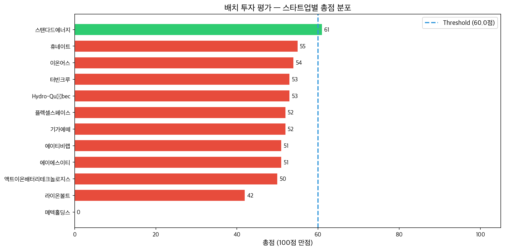
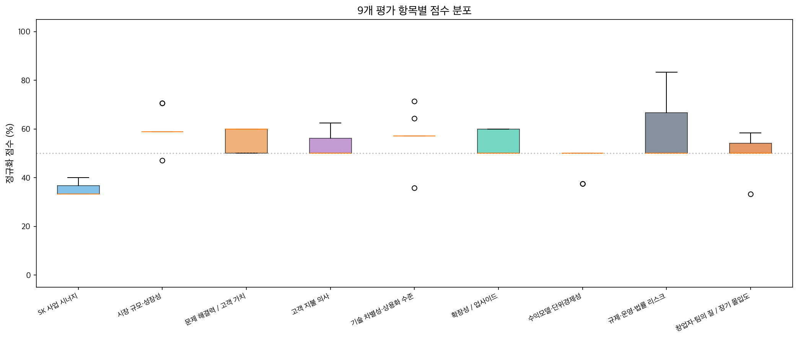

# VSco 시스템 평가 증빙자료

**생성일**: 2026-03-12 20:51
**시스템**: LangGraph Multi-Agent + Corrective RAG
**도메인**: Energy (배터리·ESS 중심)

---

## 1. 배치 평가 결과 요약

- **평가 대상**: 12개 스타트업
- **투자 추천(invest)**: 1개
- **기각(reject)**: 11개 (도메인 부적합 1개 포함)
- **투자 판단 기준선**: 60.0점

### 점수 통계 (도메인 적합 스타트업)
- 평균: **52.2점**
- 표준편차: 4.3
- 범위: 42 ~ 61

### 스타트업별 점수
| # | 스타트업 | 총점 | 판정 |
|---|---------|------|------|
| 1 | 스탠다드에너지 | 61 | INVEST |
| 2 | 휴네이트 | 55 | REJECT |
| 3 | 이온어스 | 54 | REJECT |
| 4 | 터빈크루 | 53 | REJECT |
| 5 | Hydro-Québec | 53 | REJECT |
| 6 | 플렉셀스페이스 | 52 | REJECT |
| 7 | 기가에떼 | 52 | REJECT |
| 8 | 에이에스이티 | 51 | REJECT |
| 9 | 에이티비랩 | 51 | REJECT |
| 10 | 액트이온배터리테크놀로지스 | 50 | REJECT |
| 11 | 라이온볼트 | 42 | REJECT |
| 12 | 메텍홀딩스 | 0 | REJECT |






---

## 2. 9개 평가 항목 횡단 분석

- **SK 사업 시너지** (15점 만점): 평균 5.3점 (35%)
- **시장 규모·성장성** (17점 만점): 평균 10.2점 (60%)
- **문제 해결력 / 고객 가치** (10점 만점): 평균 5.6점 (56%)
- **고객 지불 의사** (8점 만점): 평균 4.3점 (53%)
- **기술 차별성·상용화 수준** (14점 만점): 평균 8.0점 (57%)
- **확장성 / 업사이드** (10점 만점): 평균 5.4점 (54%)
- **수익모델·단위경제성** (8점 만점): 평균 3.8점 (48%)
- **규제·운영·법률 리스크** (6점 만점): 평균 3.5점 (59%)
- **창업자·팀의 질 / 장기 몰입도** (12점 만점): 평균 6.1점 (51%)

---

## 3. Corrective RAG 파이프라인 분석

- 총 RAG 검색 쿼리: 0건
- 검색된 문서 수: 0건
- 관련성 필터 통과: 0건 (**통과율 0.0%**)
- 쿼리 리라이트 발동: 0건
- 웹 검색 fallback: 0건


---

## 4. RAGAS RAG 품질 평가

- 평가 질문 수: 15개

| 메트릭 | 점수 |
|--------|------|
| Faithfulness (충실도) | **0.9611** |
| Response Relevancy (응답 관련성) | **0.8371** |
| Context Precision (컨텍스트 정밀도) | **0.9869** |
| Context Recall (컨텍스트 재현율) | **1.0000** |

---

## 5. 시스템 아키텍처

```
┌─────────────────────────────────────────────────┐
│              VSco 투자 평가 시스템               │
├─────────────────────────────────────────────────┤
│                                                 │
│  [Startup Search] ──→ [Domain Check]            │
│        │                    │                   │
│        ▼                    ▼                   │
│  ┌──────────┐  ┌────────────────┐              │
│  │Tech Anal.│  │Market/Policy   │  (병렬 + RAG)│
│  │  + CRAG  │  │  + CRAG        │              │
│  └────┬─────┘  └───────┬────────┘              │
│       └────────┬───────┘                       │
│                ▼                                │
│       [Competitor Analysis] (웹 검색)           │
│                │                                │
│                ▼                                │
│    [Investment Decision + CRAG]                 │
│       9항목 가중합 = 100점                      │
│                │                                │
│                ▼                                │
│       [Evaluation Check]                       │
│                │                                │
│                ▼                                │
│         [Report Writer]                        │
│                                                 │
├─────────────────────────────────────────────────┤
│ RAG: FAISS(bge-m3) + Corrective RAG            │
│ LLM: GPT-4o-mini  │ 검색: Tavily              │
│ 문서: 4 PDF (174 chunks)                       │
└─────────────────────────────────────────────────┘
```